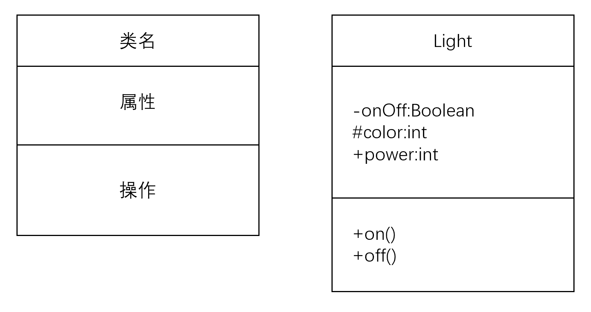
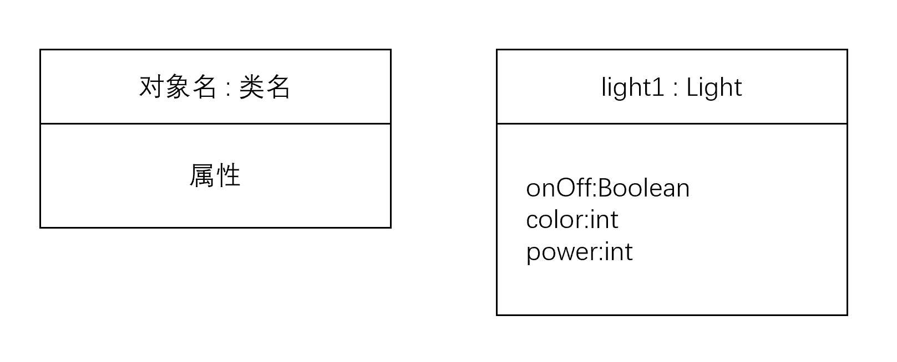

# C++ OOP笔记3：类、对象、构造函数、析构函数

> 本文全部内容基于西安电子科技大学潘蓉老师的《面向对象程序设计》课程记录而成。更多其他技术类内容可关注我的掘金和知乎： https://juejin.cn/user/1996368848621319/posts、[李经纬 - 知乎 (zhihu.com)](https://www.zhihu.com/people/li-jing-wei-78/posts)
>
> 有其他意见和建议欢迎联系，QQ：1428319077

## 软件开发与面向对象

#### 好软件应该有的特点

可重用、可扩展（容易在现有基础上创建新的子系统）、可维护性（能适应需求的变化）

### 开发思想和方法

#### 面向过程

- 按照功能划分软件结构——确定整个系统的输入输出，再把中间过程分为一个个小的子系统，每个子系统也都是有着输入输出的，把这些部分连接起来就是整个系统。

- 以函数作为主体，整个程序耦合程度高。

#### 面向对象

- 将软件系统看作对象的集合；
- 系统结构相对稳定。“对象”相对于“功能/过程/函数”而言变化更少；
- 对象能够把函数的定义进行封装；
- 提高软件可重用性、可维护性、扩展性。

## 抽象

抽象的重点在于提取一个实体的本质，即对复杂的事物进行本质的提取和简化。

抽象过程抽象出的特征等，应该都是与系统相关的。一个抽象越简单，就越通用。

一个实体，会有许多可能的抽象的方式。需要注意根据实际需求进行针对性的抽象。

抽象所拥有的属性和行为，不应超出一开始定义的目的。

## 类的抽象和定义

**对象，是具体事物的抽象。**

对象是将**状态**（数据/属性）和**行为**（行为/操作/函数）捆绑在一起的软件结构或模块。也就是说，对象，是确定了属性值的，类的实例。

**类，是对具有相同特征的对象的进一步抽象。**

类是描述一组相似对象共有特征的抽象。类可以控制其中变量和函数在外部的可见性——即，可以设置某些变量/函数只有在该类对象内部可以访问——这样可以提升程序的安全性。

**从类创建对象的过程被称为“实例化”。**

从一个类实例化的不同对象具有相同的结构，但可以有不同的数据值。

#### 类的 UML 表示法



\+ : public

\- : private

\# : protected


#### 访问权限控制

public、private、protected，三者可以多次出现。一般来说前两者写在类的前面。

在一个类的外面，只能访问公有（public）的成员。

私有成员只能被本类中的函数访问和友元函数访问，在类外不可见。

保护成员，对该类的派生类（即，继承了该类的子类）而言，和public的一样，对其他的则和private一样。

#### 成员

- 数据成员不能在类体内部进行显式初始化，比如 int number = 1。初始化通过构造函数（构造器）初始化。
- 成员函数的声明和原来一样。他们应该是对进行了封装的（private里面的）数据进行操作的唯一途径。成员函数可以在类内或类外进行定义。**在类内定义的函数将自动成为内联函数。**


#### 多文件类的定义（构造、析构函数见本页尾）

```cpp
//time.h
class Time {
public:
    Time(int newH, int newM, int newS = 10);// 参数可有可无可默认，构造器可重载
    										// 默认值需要在声明时添加
    ~Time();		// 析构函数没有参数，不能被重载。
	void setTime(int newH, int newM, int newS);
	void showTime();
private:
	int hour, min, second;
};


// time.cpp
#include "time.h"	// 需要包含声明的文件

// 使用函数体进行初始化
Time::Time(int newH, int newM, int newS) {
    hour = newH;
    min = newM;
    second = newS;
}
// 使用初始化列表进行初始化
Time::Time(int newH, int newM, int newS): hour(newH), min(newM), second:(newS) {}
Time::~Time(...) {
    ...
}

void Time::setTime(int newH, int newM, int newS) {
    hour = newH;
    min = newM;
    second = newS;
}
void Time::showTime() {
    ...
}

// 实例化对象（会使用到无参构造器）时的写法：
Time myTime1;

// 实例化对象(有且仅有带参数构造器)时的写法：
Time myTime(...);
```


## 创建对象

<类名> <对象名表>;

在创建时才会分配存储空间，类仅仅是类型的定义。

对象名表，可以声明成为指针、引用名、对象数组。

#### 对象的UML



## 类成员的访问

- 可以通过对象来直接访问公有成员；
- 类中可以直接使用成员名来访问所有成员；
- 对象名和成员名访问：例：Time.showTime();
- 通过对象指针变量访问：例：TimePtr->showTime();
- 通过引用访问。


各个对象空间中只有数据成员。成员函数只存在一份，由所有对象共享。


## 构造函数、析构函数

#### 构造函数、析构函数

构造函数在实例化时自动调用，按照我们定义的过程来自动进行初始化；析构函数在对象生命周期末端自动调用，按照我们定义的过程执行清除工作。在没有给变量初始化时，其中的值是随机的。

构造函数，在定义对象时，被**编译系统**自动调用，创建并初始化对象。

对于没有构造器的类，编译系统会准备一个默认的无参构造函数，该函数体为空，什么也不做。

对于显式定义了带参数构造函数的类，编译系统不会自动加上那个默认的无参构造函数。如果不调用这样的写法会报错。

- 析构函数只是在生命周期末端完成一些清理工作，并不会回收空间。这个空间应该是系统管理释放。析构函数不能有参数，因此也不能被重载；
- 一般，构造函数的调用顺序与声明对象的顺序相同，析构函数则相反；

##### 构造、析构函数调用时机

全局对象的构造函数在所有函数（包括main）执行前调用，main执行结束或调用exit时调用析构函数；

局部自动对象：实例化时构造，函数调用结束、对象释放时先调用析构器；

函数中的静态局部对象：第一次调用其所在函数时调用构造器构造，调用结束不释放，直到main执行完或调用exit时才调用析构器。

### 复制（拷贝）构造函数

**复制构造器的名字与类名相同，不指定类型，只有一个参数且是对同类对象的引用。**

- 对象可以进行赋值和复制

  - 赋值：两个同类的、已存在的对象，可以进行赋值。这样的赋值是整体进行的，与访问权限无关。

    ```
    <对象1> = <对象2>;
    ```

  - 复制：建立一个新对象，并让它和原有对象一样

    ```
    <类名> <对象2>(<对象1>);
    <类名> <对象2> = <对象1>;
    ```

    若未定义复制构造函数，这样就是“默认按成员初始化”。

    ```
    <类名> (const <类名>& <对象名>);	// 声明复制构造函数
    							// 这里的&表示引用，对后面的对象参数进行引用
    							// 总而言之，这是一个指向同类对象的常引用
    
    <类名>::<类名> (const <类名>& <对象名>) {	// 实现
    	...
    }
    ```

    用例：

    ```cpp
    TAdd(const TAdd& p) {
    	x = p.x;		// 这里可以定义自己的复制逻辑
    	y = p.y;
    	cout<<"复制构造器"<<endl;
    }
    ```

    系统默认的复制构造函数，就是做单纯的一对一拷贝。
  
- 使用复制构造器的情况

  ```cpp
  // 1. 直接的复制使用，略。
  // 2. 函数用对象作为参数，在调用时需要把实参完整地传递给实参
  void func(Box b) {
      ...
  }
  
  int main() {
      ...
      Box box1(1, 3, 5);
      func(box1);	// 系统会进行从box1(实参)到b(形参)的复制，这里就自动调用复制构造器
      ...
  }
  
  // 3. 函数的返回值是对象，函数调用结束要把返回值带回调用处
  Box func2() {
      Box box1(1, 2, 3);
      return box1;
  }
  
  int main() {
      Box box2;
      box2=func2();	/* 其实在调用时，box1 先被复制到了一个临时对象中，
      				   然后再被赋值给了box2。这里调用的都是复制构造器。
      				*/
      return 0;
  }
  ```

  


