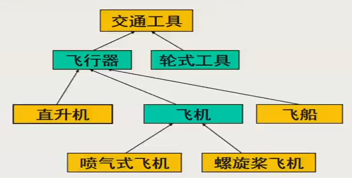
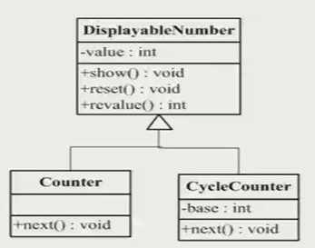
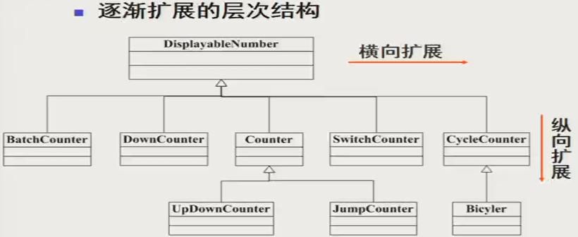
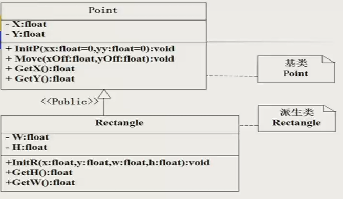
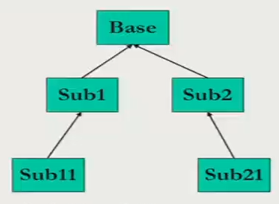
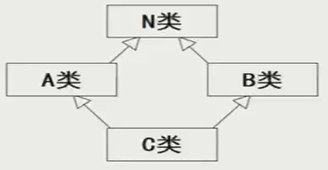
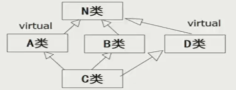

# C++ OOP笔记7：类的继承、多继承与虚基类

> 本文全部内容基于西安电子科技大学潘蓉老师的《面向对象程序设计》课程记录而成。更多其他技术类内容可关注我的掘金和知乎： [掘金](https://juejin.cn/user/1996368848621319/posts)、[李经纬 - 知乎 (zhihu.com)](https://www.zhihu.com/people/li-jing-wei-78/posts)
>
> 有其他意见和建议欢迎联系，QQ：1428319077

## 继承

继承关系图。向上的箭头指向直接父类。



关于这样的继承关系的三种表述方法：（即，同义词）

父类、子类；基类、派生类；超类、次类。

从上向下被称为“特化”，向上则被称为“概化”。在继承中，派生类可以覆盖基类方法、添加新的属性和方法。

##### 例

```cpp
// 每次自增1，无限增长
class Counter {
private:
    int value;
public:
    Counter(int initValue);
    Counter();
    void show();
    void next();        // 自增
    void reset();
    int revalue();
};

// 每次自增1，有循环
class CycleCounter {
private:
    int value;
    int base;        // 循环基数
public:
    CycleCounter(int initValue);
    CycleCounter();
    void show();
    void next();     // 自增
    void reset();
    int revalue();
};
```

上面这两个类，其实可以往上再抽取出来一层。

下面的类，自动就有了上面的类的成员。在下面各个类中增加比较特殊的东西就可以了。



DisplayableNumber 就是一个下面两个计数器共同的基类。

类是可以不断横向、纵向进行扩展的。




### 派生类的定义

```cpp
class <派生类名>: <继承方式> <基类名> { // 继承方式：public, private, protected
                                    // 默认 private
    <派生类新定义的成员>               // 和基类重复的就不需要再进行定义了
};

// 例：
class A {
    int i;
};
class B: public A {                // 派生类将自动继承基类所有成员，但不包含构造、析构器
    int j;
};

```


### 不同继承方式的访问权限

表格内容是派生类中基类成员的访问控制权限。

|              | public 继承        | private 继承       | protected 继承     |
| ------------ | ------------------ | ------------------ | ------------------ |
| 基类公有成员 | 公有               | 私有               | 保护               |
| 基类私有     | 派生类成员不可访问 | 派生类成员不可访问 | 派生类成员不可访问 |
| 基类保护     | 保护               | 私有               | 保护               |

也就是说，基类的 private 就是 private 的，即使是派生出来的子类也是【其他的类】，故同样不能访问。派生类可以直接在本类内访问基类的保护成员。

如果非要在派生类中访问基类的私有成员，可以把派生类声明为基类的友元。

#### public 继承

派生类中的基类公有成员、保护成员在被继承后分别成为派生类的公有、保护成员。派生类的新成员可以直接访问这些成员，但是不能**直接**访问基类私有成员。

在类外，派生类的实例只能访问继承的基类的公有成员，保护的不行。。因为本来在一个类的外面（其他类、本类的实例）都只能访问这个类的 public 成员。

##### 例：从 Point 类派生 Rectangle 类（矩形）



#### protected 继承

派生类中，基类的公有、保护成员全都是派生类的保护成员。

在派生类内可以访问这些成员，但类的实例则啥基类内成员都不能访问了。。。

保护继承模式下，为了保证一些从基类继承来的对外接口仍能正常使用，就需要在派生类中重新声明同名的成员函数

```cpp
class A {
public:
    int getA() {
        return a;
    }
protected:
    int a;
};
class B: protected A {
public:
    int getA() {         // 为了起到和基类一样的效果，需要搞一个完全重名的函数
                         // 否则在外面，也即是B的实例中是访问不到A::getA()的
                         // 只能通过 B::getA() 间接取到
        return A::getA() // 显式访问基类成员
    };
protected:
    ...
};
```


#### private 继承

派生类中，基类的公有、保护成员全都是基类所私有的。

派生类的新成员可以直接访问原来基类中的公有、保护成员（但依旧不能直接访问基类的私有成员）。类外，派生类的对象不能访问基类的所有成员


### 关于继承中的构造器

#### 构造器简例

```cpp
class Point {
public:
    Point(float xx=0, float yy=0) {
        X=xx;
        Y=yy;
    }
    float GetX() {return X;}
    float GetY() {return Y;}
private:
    float X, Y;
};

class Rectangle: public Point {
public:
    Rectangle(float x, float y, float w, float h) {	// 派生类构造器
        Point(x, y); // 错！不能在派生类构造器中显式调用基类构造器！这样创建了一个无名对象！
        W=w;
        H=h;
    }
    float GetH() {return H;}
    float GetW() {return W;}
private:
    float W, H;
};

// 由于派生类不会继承基类的构造器、析构器，故派生类对于自身包含的基类成员初始化必须由派生类构造器完成
// 正确的通过基类构造器初始化基类成员的方法：
// 使用成员初始化列表。这里面可以显式调用基类构造器，完成基类成员初始化
<派生类名>(<总参数表>): <基类名>(<参数表1>), <对象成员名>(<参数表2>) {
    <派生类数据成员初始化>
};
// 上面的例：(派生类自己的对象也可以使用：成员名(值) 的写法来初始化)
Rectangle(float x, float y, float w, float h): Point(x, y), W(w), H(h) {}
```


#### 构造器、析构器调用顺序

##### 

##### 构造器

比如要实例化 Sub11。从Sub11开始上溯找到根节点（即Base），从这里开始，逐步向下调用各类构造器，直到调用 Sub11 自己的构造器。

基类构造器 -> 基类成员的构造器 -> 派生类自己的构造器

当基类中没有自定义构造器，或者只有无参构造器时，派生类构造器里面就不用再写基类的构造器了，这里将进行“隐含调用”。

当基类只有有着大于等于一个参数的构造器时，派生类必须定义构造器，将参数传递给基类构造器。

如果基类中同时有【有参数的构造器】和【没有参数的构造器】，则派生类可调可不调，不调就隐性调了。

##### 析构器

与构造器相反，先调用 Base 的。


### 派生类是基类的友元

```cpp
class A {
    friend class B;           // B 是 A 的友元，B 可以直接访问 A 里面的私有成员
public:

private:
    int getA() {
        return a;
    }
    int a;
};
class B: public A {
public:
    int callGetA() {
        return getA();        // 直接读取 A 的私有成员
    }
    int directlyGetA() {
        return a;             // 直接读取 A 的私有成员
    }
private:
    int b;
};

// 但是下面这样就不行了
A aObj;
aObj.callGetA();    // 正确
aObj.getA();        // 错误。不能直接在类外调私有成员
```

作为基类的友元，在友元派生类中，访问基类的成员不再需要像之前的“跨类”访问一样，指明要访问哪个实例才能进行对友元的访问。因为那个的本质还是俩类，但这个却已经是类套着类，变成了类之套娃，实质上是一个了。


如上图，套娃。

下面，回忆一下之前的普通友元类。。。

```cpp
class A {    // 被访问类
    ...
    friend class B;
};

class B {    // 可以对 A 的实例为所欲为
    ...
    void showA(A &a) {    // 一定要在参数中指明实例才能操作——总不能操作一个概念吧
        ...
    }
};

A a1;
B b1;
b1.showA(a1);    // 使用
```

##### 友元不能继承

比如，B 是 A 的友元，C 是 B 的派生类，则 C 和 A 并不是友元。

（王叔叔是你爹的朋友，但并不是你的朋友，所以你当然不能访问王叔叔的 private ，除非你也和王叔叔成为朋友）

## 多继承

一个派生类有多个基类，就叫多继承。单继承是多继承的特殊情况。

```cpp
class <派生类名>: <继承方式> <基类名1>, ..., <继承方式> <基类名n> {
    <派生类新定义成员>
};
// 多继承派生类构造器。总参数表 中必须！包含所有基类初始化所需的参数
<派生类名>(<总参数表>): <基类名1>(<参数表1>), ..., <基类名n>(<参数表n>) {
    ...
} 
// 基类初始化所需的参数是根据某些参数算出来的也行，比如
C(int k): A(k+2), B(k-2) {}
```

多继承派生类构造器调用顺序：所有基类构造器 -> 对象成员类构造器 -> 派生类构造器。

处于同一层次的各基类构造器的调用顺序取决于定义派生类时指定的基类顺序（从前往后），与初始化列表中的顺序无关。

若有多个成员类对象，则他们构造器的调用顺序是他们在本类中被声明的顺序，同样与初始化列表中的顺序无关。

### 多继承引起的二义性问题

#### 两个基类有同名成员

```cpp
class A {
public:
    int a;
    void display();
};
class B {
public:
    int a;
    void display();
};
class C: public A, public B {    // 这样的C中有两套 a、display()
public:
    int b;
    void show();
};

// 解决方案
C c1;
c1.A::a=3;
c1.A::display();
```

#### 两个基类和派生类都有同名成员

```cpp
// A、B 类还和上面那个例子相同
class C: public A, public B {    // 这样的C中有三套 a、display
public:
    int a;
    void display();
};

C c1;
c1.a=3;
c1.display();             // 这样直接访问是可以的，但只直接访问派生类中的成员
                          // 即，基类成员在派生类中被派生类的同名成员【屏蔽】了
c1.A::a=3;                // 但仍可通过指出作用域来访问
c1.A::display();
```

### 某个类继承了从同一个基类派生出的两个类



这样的 C 类中，将有两份 N 类成员。C面临着【选择哪条继承路径所继承下来的A】的问题

```cpp
// N中有a
c.A::a;	// 这样是 ok 的
```

这种情况，其实在某些场景下是必要的——A、B各有一种对N的初始化方式，而C同时需要这两种共同存在的情况。

## 虚基类

多数情况下，我们并不想让上面的情况出现。

将直接基类（上面的A、B）的共同基类（上面的N）设置为【虚基类】，将使共同基类（N）在内存中只有一个副本存在，从而解决对基类成员访问的二义性问题。

#### 虚基类定义

```cpp
class <派生类名>: virtual <继承方式><共同基类名>;    // <共同基类名> 就是虚基类
```

虚基类的派生类对象中，将只存在一个虚基类成员的副本。

为保证虚基类在派生类中只继承一次，应在该基类的所有直接派生类中都声明为虚基类。



这样将会导致最终的 C 中有两份N的成员。其中一份 A、D 公用，另一份通过 C 产生。

```cpp
class A {
public:
    A() {a=10; }
protected:
    int a;
};
class A1: virtual public A {
public:
    A1() {cout<<a<<endl; }        // 调用一次A的构造器。输出10
};
class A2: virtual public A {
public:
    A2() {cout<<a<<endl; }        // 不再调用A的构造器。输出10
};
class B: A1, A2 {
public:
    B() {cout<<a<<endl; }         // 10
};

B obj;
return 0;
```


#### 虚基类构造器调用顺序

先调用虚基类的构造器，再调用非虚基类的构造器。

若同一层次中有多个虚基类，则调用顺序是定义的顺序。

如果虚基类由普通类派生而来，则仍按原顺序执行：即先调用基类构造器，再调用派生类的构造器。

例：

```cpp
class Base1 {
public:
    Base1() {cout<<"Base1"<<endl; }
};
class Base2 {
public:
    Base2() {cout<<"Base2"<<endl; }
};
class Level1: public Base2, virtual public Base1 {
public:
    Level1() {cout<<"Level1"<<endl; }
};
class Level2: public Base2, virtual public Base1 {
public:
    Level2() {cout<<"Level2"<<endl; }
};
class TopLevel: public Level1, virtual public Level2 {
public:
    TopLevel() {cout<<"TopLevel"<<endl; }
};

TopLevel obj;

/* 输出：
Base1        # TopLevel 先构造虚基类 Level2（ Level2 先构造虚基类 Base1 ）
Base2        # Level2 再调用基类 Base2
Level2       # 调用 Level2 构造器 
# Level2 一侧构造完成，开始构造 Level1 一侧
Base2        # Base1在TopLevel1中也是虚基类，虚基类只需要被构造一次，故本次只构造Base2
Level1       # Level1 构造
TopLevel     # 终于轮到自己了
*/
```


#### 虚基类的初始化

如果虚基类只有带参构造器，则其所有派生类中（包括直接、间接的）都要通过构造器初始化列表对虚基类进行初始化（因为原本就需要参数。。）

```cpp
class A {
    A(int i) {...}
};
class B: virtual public A {
    B(int n): A(n) {...}
};
class C: virtual public A {
    C(int n): A(n) {...}
};
class D: public B, public C {
    D(int n): A(n), B(n), C(n) {...}    // 间接基类构造也要调用。
                                        // 因，如果让B、C自己调用A，那么可能会导致
                                        // B、C使用不同的值初始化A，而A又只有一个，产生矛盾
                                        // 该情况下，将忽略B、C对A的调用，只用D的参数调A
};
```


**如果多继承不牵涉对同一基类的派生，则没必要定义虚基类**

**多继承经常出现二义性问题，使用要非常小心**

**能用单一继承解决的问题就不要用多继承**


### 类的层次结构设计

分析所有的类，对属性分组，然后不断调整，一次次往上概化

1. 找出所有可能的候选类
2. 对这些候选类往上概化一步
3. 进行迭代分类（也就是进一步寻找共同点，分出必要的层次）
