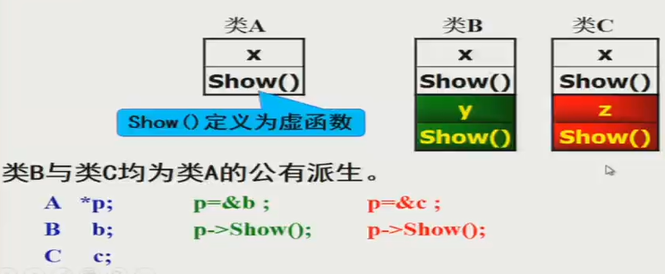

# C++ OOP笔记8：多态性与虚函数

> 本文全部内容基于西安电子科技大学潘蓉老师的《面向对象程序设计》课程记录而成。更多其他技术类内容可关注我的掘金和知乎： [掘金](https://juejin.cn/user/1996368848621319/posts)、[李经纬 - 知乎 (zhihu.com)](https://www.zhihu.com/people/li-jing-wei-78/posts)
>
> 有其他意见和建议欢迎联系，QQ：1428319077

### 类型兼容规则

在需要基类对象的任何地方，都可以使用公有的派生类的对象来替代

因为公有派生类继承了基类的所有东西，相当于整个包含了基类

- 派生类的对象可以赋值给基类的对象——用派生类从基类继承来的成员赋值给基类对象成员；

- 派生类的对象可以初始化基类的引用

  ```cpp
  class A {...};
  class B: public A {...};
  A a, *pa;
  B b;
  A &a1 = b;    // a1 和 b 不共享存储空间，而是和 B 中与 A 相同的那部分共享！
  ```

- 派生类的对象的地址可以赋值给基类的指针变量

  ```cpp
  pa = &b;    // 指向 b 中从 A 继承的那一部分，而不是 b 的全部
              // 如果 B 中有与A中同名的函数，那么通过pa->func()调用的将是A的
  ```

替代后，派生类对象就可以当作基类的对象用了。但是只能访问从基类继承的成员，也只能调用基类中包含的函数


## 多态（Polymorphism）

具有相似功能的不同函数使用同一个名称，从而可以使用相同的调用方式来调用这些有不同功能的同名函数。

##### 即：调用同一个函数名，可以根据需要来实现不同的功能

重载就是一种多态，但重载是【静态的多态】。

### 多态分类

- 静态多态（编译时多态）：编译时系统就能决定调用的是哪个函数。通过重载实现；
- 动态多态（运行时多态）：程序运行时才能动态确定操作所针对的对象（即，调用的时哪一个函数）。运行时，不同类的对象调用各自的虚函数。

### 联编

将标识符名称和存储地址关联起来的过程。比如调用一个函数，函数名和函数的地址就是联系在一起的。多态实现过程中，确定调用哪个同名函数的过程就是联编（又名绑定）。

#### 联编分类

- 静态联编：编译时确定调用哪个函数的代码。常在重载时使用。
- 动态联编：只能在程序执行过程中，通过具体的执行情况动态确定。通过继承和虚函数实现。

如果想要用指向基类的指针指向派生类并调用派生类中的函数，就需要利用动态多态，将基类中的函数声明为虚函数。这样的，同一类族中不同类的对象，对同一函数调用做出不同响应，叫做【由虚函数实现的动态多态】。

比如，演员、发型师、外科医生都是人类的实例，并且都有名为 cut() 的函数，可是做的事情截然不同。

## 虚函数的使用

- 类之间满足类型兼容规则（也就是有继承关系、有同名函数替代的情况）；
- 同名声明虚函数：在基类和派生类中都同名声明虚函数——派生类中要有与基类中完全同名的函数的定义——函数名、参数表、返回值都完全相同；
- **通过基类对象指针或对象引用来调用虚函数**。如果使用对象调用则仍是静态联编。

### 虚函数

在基类中被 virtual 说明、在一个或多个派生类中被重新定义的成员函数（也就是说只剩名字参数返回值一样，别的全都要在子类重写）

```cpp
virtual <返回值类型> <函数名>(<参数表>);
```

要访问派生类中的同名函数，必须将基类中的同名函数定义为虚函数。

如此一来，就可以声明一个指向基类的指针，然后将这个指针重新指向不同的派生类对象——每次重新指向一个对象，就可以调用其特有的与虚函数重名的函数（需要通过调用指针/引用所指向的虚函数才能实现动态的多态性，不能通过对象来调用）。



例：

```cpp
class Student {
public:
    virtual void print() {
        cout<<...;
    }
};
class GStudent: public Student {
public:
    virtual void print() {    // 这里的 virtual 可省略
        cout<<...;
    }
};

int main() {
    Student s1, *ps;
    GStudent s2;
    ps = &s2;
    ps->print();             // 调用的是 GStudent 中的print 
}
```

virtual 函数无论派生了多少层，都会一直保持 virtual（这被称为“继承虚特性”，从【开始虚的地方】开始沿着继承关系向下传），派生类中进行重新定义时可以省略 virtual 关键字。只需要基类中有就可以了。

实际使用中不同操心类的继承路径之类，直接把虚函数瞎击毙写上调用就能通过动态联编得到正确的结果。

使用对象引用调用虚函数

```cpp
class Student {
public:
    virtual void print() {
        cout<<"student"<<endl;
    }
};
class GStudent: public Student {
public:
    virtual void print() {
        cout<<"graduated student"<<endl;
    }
};
void fun(Student &s) {  // 对象的引用作参数
    s.print();          // 通过对象引用调用虚函数
}

GStudent s1;
fun(s1);                // 这样调用的就是派生类的虚函数，打印graduate..
```


动态多态的力量：可以简单组织复杂的调用


静态成员函数、友元函数（因二者不属于任何一个对象，没有多态特征），内联成员函数（编译时代码已明确确定并替换，而多态是要在运行时才能确定要调用哪一段的代码）不能为虚函数。

（但，加了 virtual 且在类内被定义的函数并不再算做是内联函数）

构造器不能是虚函数，析构器可以是。

```cpp
virtual ~<类名>();
```

例：

```cpp
class Base {
public:
    Base() {}
    ~Base() {                // 不定义为虚函数
        cout<<"Base destructor"<<endl;
    }
};
class Deriverd: public Base {
public:
    Deriverd() {}
    ~Deriverd() {            // 不定义为虚函数
        cout<<"Deriverd destructor"<<endl;
    }
};
int main() {
    Base *b = new Deriverd;
    delete b;   // 这样算静态联编，b被关联到基类对象，只会调用基类的析构器
                // 输出只有：Base destructor
                // 这样就会跳过派生类析构器中的内存释放逻辑，导致内存泄漏
    return 0;
}
//==============================
class Base {
public:
    Base() {}
    virtual ~Base() {            // 虚函数
        cout<<"Base destructor"<<endl;
    }
};
class Deriverd: public Base {
public:
    Deriverd() {}
    ~Deriverd() {                // 虚函数
        cout<<"Deriverd destructor  ";
    }
};
int main() {
    Base *b = new Deriverd;
    delete b;   // 动态联编，b被关联到派生类对象，会先调派生类析构器，再调基类析构器
                // 输出：Deriverd destructor  Base destructor
                // 会执行派生类的析构器，能够避免内存泄漏
    return 0;
}
```


虚函数为一个类簇中所有派生类的同一行为提供了统一的接口。调用类簇时只需要记住一个接口即可。


稍微实际一点的用法示例：

```cpp
const double PI = 3.14159;
class Point {
private:
    int x, y;
public:
    Point(int X=0, int Y=0) {
        this->x = X;
        this->y = Y;
    }
    virtual double area() {
        return 0.0;
    }
};
class Circle: public Point {
private:
    double radius;
public:
    Circle(int X, int Y, double R): Point(X, Y) {
        radius = R;
    }
    virtual double area() {
        return PI*radius*radius;
    }
};

Circle C1(10, 10, 20);
Point *Pp;
Pp = &C1;            // 基类对象指针
cout<<Pp->area();    // 正确。打印圆的面积
Point & Rp = C1;     // 基类对象引用
cout<<Rp->area();    // 正确。打印圆的面积
```


若派生类中定义了虚函数的重载函数，且没有定义虚函数，则**重载函数将覆盖派生类中的虚函数**。尝试使用虚函数将产生错误。（但仍可用基类中定义好的虚函数）

如果派生类中不重新定义虚函数，则不会动态联编，派生类对象将使用基类的虚函数代码


### 纯虚函数

用 virtual 声明，没有任何实现，必须由派生类重新定义并进行实现

```cpp
virtual <返回值类型> <函数名>(<参数表>) = 0;
// 基类中的纯虚函数直接赋值为 0 即可，永远不会被直接用到
// 其存在的意义只是为了提供一个多态的接口，
// 必须在派生类中被重新定义
```

注意，纯虚函数和【函数体为空】的虚函数不同，前者没有函数体且不能被实例化，后者有函数体只不过是空的，可以被实例化

```cpp
virtual void func() {}    // 函数体为空的虚函数
virtual void func() = 0;  // 纯虚函数
```


### 抽象类

抽象类：包含一个 / 多个纯虚函数的类，其无法被实例化。其只能作为派生类的基类，而不能直接生成对象

如果派生类没有实现**所有的**纯虚函数，那该派生类也是抽象类。必须在将所有纯虚函数都实现后，该类才能进行实例化。

抽象类不能用作参数类型、函数值类型、显式转换类型。但是**可以声明指向抽象类的指针或引用，通过指针或引用指向其派生类的对象**，实现动态多态。


例：

```cpp
const double PI=3.14159;
class Shapes {
public:
    void setValue(int d, int w=0) {
        x=d;
        y=w;
    }
    virtual void area() = 0;    // 纯虚
protected:
    int x, y;
};
class Square: public Shapes {
public:
    void area() {               // 实现虚函数
        cout<<x*y<<endl;
    }
};
class Circle: public Shapes {
public:
    void area() {               // 实现虚函数
        cout<<PI*x*x<<endl;
    }
};

int main() {
    Shapes *ptr[2];    // 指向抽象类类型的指针
    Square s1;
    Circle c1;
    ptr[0]=&s1;        // 抽象类指针指向派生类对象
    ptr[0]->setValue(10, 5);
    ptr[0]->area();    // 抽象类指针调用派生类成员函数
    ptr[0]=&c1;
    ptr[1]->setValue(10);
    ptr[1]->area();
    return 0;
}
```


例：

```cpp
class B0 {
public:                             // 留给外部的接口
    virtual void display() = 0;     // 纯虚函数
};
class B1: public B0 {
public:
    void display() {                // 实现虚函数
        cout<<"B1::display()"<<endl;
    }
};
class D1: public B1 {
    void display() {                // 重新定义
        cout<<"D1::display()"<<endl;
    }
};

void f1(B0* ptr) {      // 将一个抽象基类的指针，通过这个指针访问不同的函数
    ptr->display();
}

int main() {
    B0 *p;
    B1 b1;
    D1 d1;
    p = &b1;
    f1(p);             // 基类指针指向派生类对象，输出：B1::display()
    p = &d1;
    f1(p);             // 基类指针指向派生类对象，输出：D1::display()
                       // 中间的多少层继承直接穿透，拿到最终的实现
}
```
