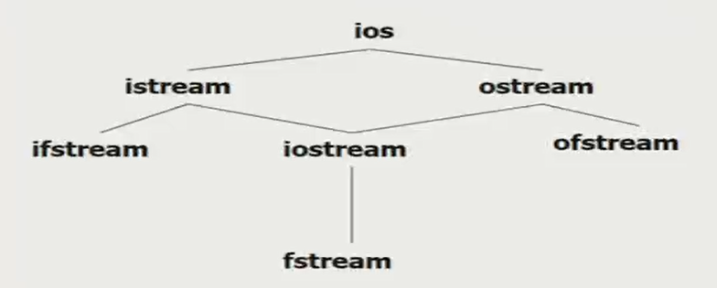

# C++ OOP笔记9：输入输出流

> 本文全部内容基于西安电子科技大学潘蓉老师的《面向对象程序设计》课程记录而成。更多其他技术类内容可关注我的掘金和知乎： https://juejin.cn/user/1996368848621319/posts、[李经纬 - 知乎 (zhihu.com)](https://www.zhihu.com/people/li-jing-wei-78/posts)
>
> 有其他意见和建议欢迎联系，QQ：1428319077

### printf、scanf的缺点

- 非类型安全。可以输入/输出各种类型的数据。如果scanf的地址写错，可能会让程序硬写内存导致一些危险的后果
- 不可扩充性。没办法输出复杂的东西

C++使用类型安全的 I/O 流操作，不同类型的 I/O 流操作都是重载的，没定义过 I/O 功能的类型不具备 I/O 操作的能力。通过重载，可以对 I/O 进行自定义的修改和扩充。

C++ 使用输入输出流进行 I/O

### 流 Stream

流，是字节的序列。从一个位置流向另一个位置。输入输出，就是字符序列在内存和外设之间的流动。

从流中获取数据：提取操作（输入操作）

向流中添加数据：插入操作（输出操作）

输入流：从外设到内存；

输出流：从内存到外设。

### C++ I/O流类库的层次结构

I/O 流类库有两个平行基类：streambuf、ios

常用 ios，ios 有 istream（输入流类）、ostream（输出流类）、fstreambase（文件流类基类）、strstreambase（字符串流类基类）



I/O流类库头文件

- iostream

  其包含 cin、cout、cerr（非缓冲方式，内容会迅速显示出来）、clog（缓冲方式，会先存入缓冲区，缓冲区刷新才显示） 四个流对象

- fstream 用于文件
- strstream 用于字符串流IO
- stdiostream
- iomanip 使用格式化 I/O，可以包含控制符 / 操作符

### 无格式输入输出

#### 输出：cout<<

"<<"：插入运算符，作用在 cout 对象上。向流中添加数据（插入操作）

cout 是 ostream 的对象，其在 iostream 头文件中作为全局对象定义如下：

```cpp
ostream cout(stdout);		// 定义如此，stdout 就是屏幕
```

单个字符输出

```cpp
cout.put('a');
cout.put(71).put(79);	// ascii，这样是连续调用
```


#### 输入：cin>>

“>>”：提取运算符，作用在 cin 对象上

其为 istream 流类的对象，同样在 iostream 中作为全局对象定义如下：

```cpp
istream cin(stdin);		// stdin： 键盘
```


## 输入输出格式控制

### 使用流对象的有关成员函数进行格式化 I/O

- 格式由各种状态标志来确定，在ios中都是16进制的4位数表示。

- 使用时要用 ios:: 前缀，使用符号名指定。

  ```cpp
  long ios::setf(long flags);		// 追加状态标志，在现有的之上加
  long ios::unsetf(long flags);	// 清除标志
  long ios::flags();	// 获取状态标志
  long ios::flags(long flag);	// 将流的状态标志位设置为flag
  							// 并返回【设置前的】状态标志值
  							// 将会将过去的所有flag清0
  // 这些函数需要使用流类对象进行调用
  <流对象名>.<函数名>(ios::<状态标志>)
  cout.setf(ios::showpos);	// 正数前面加正号
  cout.setf(ios::scientific);	// 科学计数法表示
  cout.setf(ios::showpos | ios::scientific);	// 同时生效
  ```

- 设置输出宽度，不够的补空格。默认是0，就按照实际的往出打

  ```cpp
  int ios::width(int len)	// 返回设置之前的宽度
  int ios::width()		// 返回当前宽度
  // width 函数只会对后面紧跟着输出的第一个输出项有效！
  cout<<i<<j;	// 只有 i 会起作用
  ```

- 设置填充字符

  ```cpp
  char ios::fill(char ch);// 返回设置之前的。和width配合使用填空
  char ios::fill();		// 返回当前
  ```

- 类似的，还有 precision(int p)（浮点输出精度，是整个数字长度，有效位数!）

例：

```cpp
int main() {
    int i;
    i = cout.width();
    cout<<"width:"<<i<<endl;
    cout.width(8);
    cout<<cout.width()<<i<<endl;
    char c;
    c = cout.fill();
    cout<<"filling word is:"<<c<<"(ASCII code"<<(int)c<<")"<<endl;
    cout.fill('*');
    cout<<cout.fill()<<"("<<(int)cout.fill()<<")(new filling word)"<<endl;
    int j;
    j = cout.precision();
    cout<<"precision:"<<j<<endl;
    cout.precision(8);
    cout<<123.456789<<"(example)"<<endl;
    cout<<cout.precision()<<"(new precision)"<<endl;
    return 0;
}

/** 以下是打印输出
width:0
       8(new width)
filling word is: (ASCII code32)
*(42)(new filling word)
precision:6
123.45679(example)
*/
```

#### 用于字符输入的流成员函数

##### get函数读入字符

```cpp
int a;
char b;

a = cin.get();	// 输入的值是返回值
cin.get(b);		// 读取成功就把读到的赋给 b。成功返回非0值，失败返回0
// cin.get(字符数组/字符指针, 字符个数n, 终止字符);
// 连续读取 n-1 个字符赋给数组指针，末尾自动加\0
// 如果在 n-1 个字符前遇到了终止字符，则读取提前结束
// 例：
int main() {
    char ch[20];
    cin.get(ch, 10, '/');
    cout<<ch<<endl;
    cin.get(ch, 20, '\n');	// 如果读到换行为止，则 \n 是可省略的
    cout<<ch<<endl;
    return 0;
}
/* 输出例：
you!/her.	// 第一个 cin 对应的输入
you!		// 只读到 / 位置
/her.		// 第二个 cin 对应的输入，从刚才停下的位置继续开始。输出。 
*/
```

##### getline读取一行

```cpp
char ch[20];
cin.getline(ch, 20, '/');
```

getline 读取停止后，字符指针会移到所读的最后一个字符的下一个的位置，而带三个参数的 get 不会——最终会停止在终止字符的位置


#### istream的其他成员函数

##### eof函数

无参函数，表示文件结束。从输入流读数据。到文件末尾（遇到文件结束符）返回非0值（真），否则为0（假）

常用在循环语句中，判断循环是否结束

```cpp
while(!cin.eof())
    ...
// 没有到文件末尾就继续，到了就跳出循环
```

##### peek函数

观察一下指针所指的当前字符并返回，不会将指针后移。

##### putback()


##### ignore()

```cpp
cin.ignore(n, 终止字符); 	// 忽略输入流中的 n 个字符，或遇到终止提前结束
cin.ignore(5, 'A'); // 跳过 5 个字符，遇到 'A' 就不再跳

ignore(); // 无参数情况下，等价于 ignore(1, EOF)，也就是只跳一个
```


### 使用专门的控制符进行格式化 I/O

可以不直接以标志位方式处理流的状态。这些控制符不属于任何类成员，定义在 iomanip 头文件中

```cpp
#include <iostream>
#include <iomanip>

using namespace std;

int main() {
    char *p = "12345", *q="678";
    char f[4], g[4];
    int i = 10;
    cout<<p<<setw(6)<<q<<setw(4)<<p<<q<<endl;	// 设置输出宽度
    cin>>setw(4)>>f>>g;		// 设置输入宽度
    cout<<f<<endl<<g<<endl<<"i:"<<i<<endl;
    return 0
}

/*
12345   67812345678		// q只有三个数，要右对齐，所以最前空了三个格
						// 后面 setw(4) 小于实际宽度，所以按实际显示
12345					// 键盘敲12345
123						// 设置的输入宽度为4，所以只存下了3个字符
						// 超长的部分被截断，放到下一个输入里面
45
i:10					// 所有控制符都失效，直接显示

*/

```

##### setfill(char)

用 char 填充空白的地方。常与 setw(int) 联合使用

设置后到下一次设置前一直有效！参数可以是字符常量或变量

##### setprecision(int)

指明输出实数的有效位数。默认是6

以 fixed、scientific 形式输出时，参数时小数的位数

##### setiosflags(ios::fixed)

定点方式表示实数

##### setiosflags(ios::scientific)

科学计数法表示实数

##### setiosflags(ios::left)

输出数据左对齐

##### setiosflags(ios::left)

输出数据右对齐

##### 其他参数：

uppercase大写；showpos正数带"+"；skipws忽略前导空格

##### resetiosflags()

终止所有格式状态。括号内可以填参数指定内容

#### 例：

```cpp
#include <iostream>
#include <iomanip>

using namespace std;

int main() {
	double values[] = {1.23, 35.36, 653.7, 1234.56};
    char *names[] = {"Zoot", "Jimmy", "AI", "Stan"};
    for(int i=0; i<4; i++) {
        cout<<setiosflags(ios::left)	// 设置左对齐
            <<setw(6)<<names[i]			// 设置输出长度
            <<resetiosflags(ios::left)	// 取消左对齐
            <<setw(10)<<values[i]		// 设置输出长度
            <<endl;
    }
    return 0
}

/*
Zoot       1.23
Jimmy     35.36
AI        653.7
Stan    1234.56
*/
```

